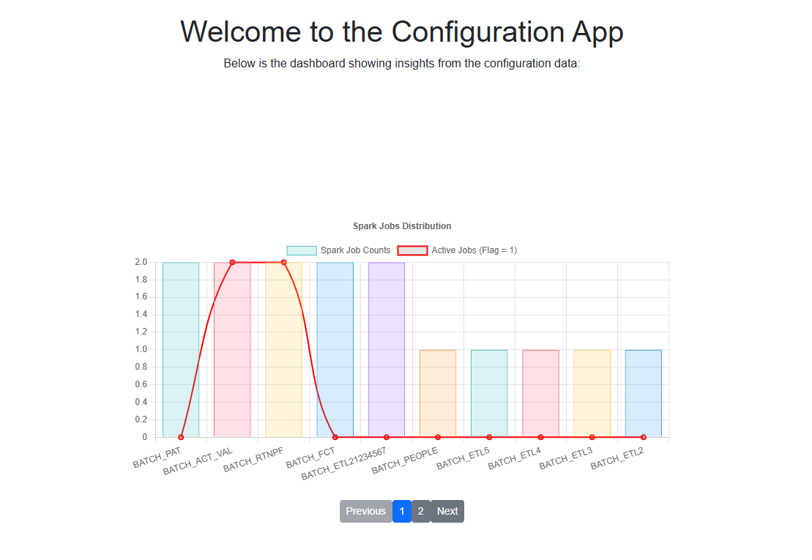

## simple web config app for spark data job configs

- edit or delete spark job config
- keys is filename

# Pre-requisites library

- create folder named library in ~/.
- pip download flask==3.1.0 --python-version 39 --only-binary :all:
- pip download importlib-metadata==3.6 --python-version 39 --only-binary :all:

- below is chart of spark jobs config based on master_job.csv

